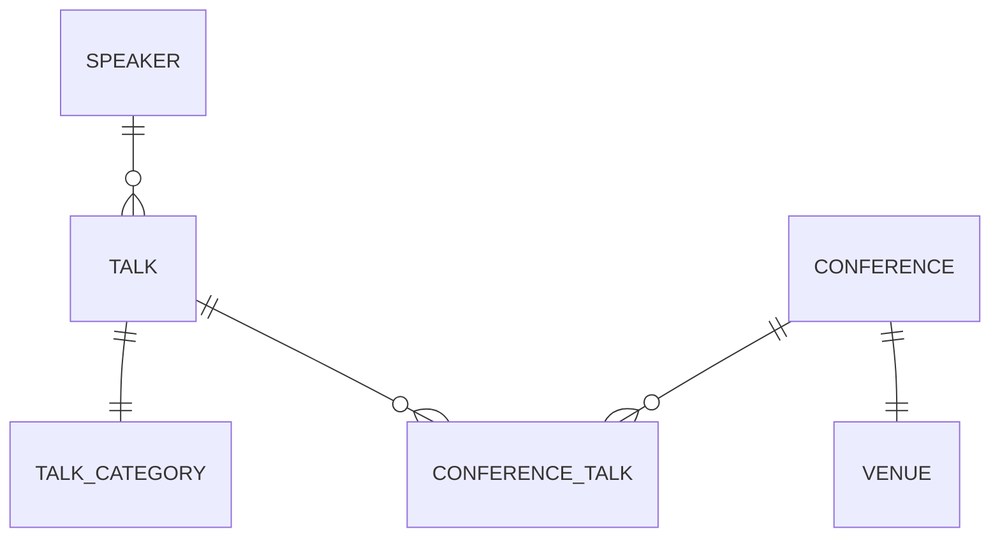

# MOCA CONF

IT IS JUST A DEMO PROJECT FOR THE SPEECH

IT IS STILL UNDER ACTIVE DEVELOPMENT

## What is it?

Welcome to the moca-conf application repository! This application is designed to help organize conferences, manage  
speakers, and schedule programs using Laravel and Filament.

## About the Talk

This repository is part of my upcoming speech at [MOCA 2024](https://moca.camp), titled **"Rapid Application Development with Laravel and Filament"**.

During the talk, I will demonstrate how to quickly build robust applications using Laravel and Filament,  
focusing on how these tools can streamline the development process.

## Application Features

- **Conference Management:** Easily create and manage conferences.
- **Speaker Management:** Add, edit, and organize speaker information.
- **Program Scheduling:** Plan and schedule conference programs and sessions.

and why not, a little of AI to help us to manage the conference.

## Application Stages

### 00: Installing Laravel

In this stage, we will install Laravel and set up the project.

```bash
laraven new moca-conf
```

I've choosen SQLite as the database for this project and Pest as the testing framework.

### 01: INIT TailwindCSS, Pest, Larapint, PHPStan and Larastan

- **TailwindCSS:** A utility-first CSS framework for rapidly building custom designs.
- **Laravel Pint:** Code style fixer for minimalists
- **Pest:** A delightful PHP Testing Framework with a focus on simplicity.
- **PHPStan:** A PHP Static Analysis Tool that focuses on finding errors in your code without actually running it.
- **Larastan:** A PHPStan wrapper for Laravel that focuses on finding errors in your Laravel code.

#### TailwindCSS

```bash
npm install -D tailwindcss postcss autoprefixer
npx tailwindcss init -p
```

or with Bun

```
bun install -D tailwindcss postcss autoprefixer
bun tailwindcss init -p
```

then follow the instructions in the [TailwindCSS documentation](https://tailwindcss.com/docs/guides/laravel).

#### Laravel Pint

```bash
composer require laravel/pint --dev
```

#### Pest

In the laravel installation wizard we've choosen Pest as the testing framework, so we don't need to install it. I'm
installing
some additional plugins and package to help us to write tests.

```bash
composer require pestphp/pest-plugin-livewire --dev
composer require pestphp/pest-plugin-faker --dev
```

#### PHPStan and Larastan

```bash
composer require --dev "larastan/larastan:^2.0"
```

configure `phpstan.neon` file

```neon
includes:
    - vendor/larastan/larastan/extension.neon

parameters:

    paths:
        - app/

    # Level 9 is the highest level
    level: 9

#    ignoreErrors:
#        - '#PHPDoc tag @var#'
#
#    excludePaths:
#        - ./*/*/FileToBeExcluded.php
#
#    checkMissingIterableValueType: false
```

and run first analysis

```bash
./vendor/bin/phpstan analyse
```

in first instance we should fix `User` model specifying the factory class.

### 02: Models

In this stage, we will create the following models:

- **Speaker:** A model to store speaker information.
- **Talk:** A model to store talk information.
- **TalkCategory:** A model to store talk TalkCategory information.
- **Conference:** A model to store conference information.
- **Venue:** A model to store venue information.

Pivot model:

- **ConferenceTalk:** A pivot model to store the relationship between conferences and talks.



For local development, we have created factories and seeders for each model.

```bash  
php artisan migrate:fresh --seed
```  

### 03: Filament Panel Builder

Filament Panel Builder is a package that allows you to create custom admin 
panels for your Laravel applications: Panels are the top-level container 
in Filament, allowing you to build feature-rich admin panels that include 
pages, resources, forms, tables, notifications, actions, infolists, and 
widgets

In this stage, we will install Filament and set up the project.

See the official docs for more information: 
[Filament Panel Builder](https://filamentphp.com/docs/3.x/panels/installation)

```bash
composer require filament/filament:"^3.2" -W
 
php artisan filament:install --panels

# choose "admin" as ID
````

This will create and register a new Laravel service provider called
`app/Providers/Filament/AdminPanelProvider.php`.

The Filament Panel Builder pre-installs the Form Builder, Table Builder,
Notifications, Actions, Infolists, and Widgets packages. No other
installation steps are required to use these packages within a panel.

You can create a Filament User with this command:

```bash
php artisan make:filament-user
```

If you run the database seeders, you don't need to create a new user.

Now you can access the Filament admin panel at `/admin`.

  
### 04: Filament - Resources  

In this stage, we will create the following resources:
- **SpeakerResource:** A resource to manage speaker information.  
- **TalkResource:** A resource to manage talk information.  
- **TalkCategoryResource:** A resource to manage talk TalkCategory information.  
- **ConferenceResource:** A resource to manage conference information.  
- **VenueResource:** A resource to manage venue information.  

Resources are static classes that are used to build CRUD interfaces for your Eloquent models. They describe how 
administrators should be able to interact with data from your app - using tables and forms.

Filament can automatically generate the form and the table of each resource. It allows you to speed up the development. 
The focus of this talk and this demo project is "Rapid Application Development with Laravel".

To create the resources, we will use the following command:
  
```bash  
php artisan make:filament-resource Venue --generate  
php artisan make:filament-resource Conference --generate  
php artisan make:filament-resource TalkCategory --generate  
php artisan make:filament-resource Talk --generate  
php artisan make:filament-resource Speaker --generate  
```

The `--generate` flag asks Filament to generate the form and the table for the resource. For each resource this will 
create serveral files in the `app/Filament/Resources` directory:

E.g.:
```
app
├── Filament\
│         └── Resources\
│             ├── ConferenceResource\
│             │         └── Pages\
│             │             ├── CreateConference.php
│             │             ├── EditConference.php
│             │             └── ListConferences.php
│             ├── ConferenceResource.php
```

The resource lives in `ConferenceResource.php`. The classes in the `Pages` directory are used to customize the pages in
the app that interact with the resource.  All these pages are full-page Livewire components and are fully customizable.

It's important to note that Filament resources adhere to Laravel's authorization policies, ensuring that user 
interactions are secure and within the boundaries set by your application's access controls.

For more information: [Filament Panel Builder - Resources - Get Started](https://filamentphp.com/docs/3.x/panels/resources/getting-started)

#### DemoCommand

I created a console command to simplify the demo of the application. In this stage the command has four options:
- run a fresh migration
- run a fresh migration with seeders
- seed the database
- create a demo user.

To run the command:

```bash
php artisan mc:demo
```

#### Unguarding all models

For brevity in this demo project, we will disable Laravel's mass assignment protection. Filament only saves valid data
to models so the models can be unguarded safely.

For more information: [Eloquent Mass Assignment](https://laravel.com/docs/11.x/eloquent#mass-assignment)

### 05: Filament - Vite Hot Reload

I configure Vite to use hot reload in the Filament admin panel. Vite is a build tool that aims to provide a faster and
more reliable development experience for modern web projects.

We are focused on Rapid Application Development with Laravel and Filament, so we want to speed up the development process.

I have installed and configured Vite in stage 01. Now I will configure Vite to use hot reload in the Filament admin panel.

The `vite.config.js` must be edited to include the `app/Filament` directory in the `refresh` array:

```javascript
import { defineConfig } from 'vite';
import laravel, { refreshPaths } from 'laravel-vite-plugin';

export default defineConfig({
    plugins: [
        laravel({
            input: [
                'resources/css/app.css',
                'resources/js/app.js',
            ],
            refresh: [
                ...refreshPaths,
                'app/Livewire/**',
                'app/Filament/**', // <-- Add this line
            ],
        }),
    ],
});
```

Then we instruct the `AdminPanelProvider` to use the Vite server in the `register` method:

```php
use Filament\Support\Facades\FilamentView;
use Illuminate\Support\Facades\Blade;

// ...

public function register(): void  
{  
    parent::register();  
    FilamentView::registerRenderHook('panels::body.end', fn(): string => Blade::render("@vite('resources/js/app.js')"));  
}
```

Now, when you run the Vite server, the Filament admin panel will use hot reload.

```bash
bun run dev
#or
npm run dev
```

### 06: Filament - Form Inputs

In this stage I'm introducing some basic form inputs to the Filament resources. We apply the following form inputs to the
Venue resource, the simplest resource in the application. In next stages, after I introduced tables, actions and relations,
we will apply these form inputs to the other resources.

#### Country List

I've choosen to install `monarobase/country-list` package to provide a list of countries in the form:

```bash
composer require monarobase/country-list
```

In Tinker you can test the package:

```bash
php artisan tinker
```

and then

```php
Countries::getList(app()->getLocale())
```

#### Basic Form Inputs

FilamentPHP offers a Form Builder package. The Form Builder package is pre-installed with the Panel Builder and allows
to easily build dynamic forms in the app.

In stage `04: Filament - Resources` we have created the resources with the `--generate` flag. Filament has created
these resources with complete functional forms and tables. In this stage, we will go deeper into the form fields to
customize them.

For more information about Form Buiolder: [Filament Panel Builder - Form Builder](https://filamentphp.com/docs/3.x/forms/getting-started).

##### Form Schemas

The form schema is a static method that returns an array of fields and layout components. Fields are the inputs that your 
user will fill their data into. Layout components are used to group fields together, and to control how they are displayed.

E.g. `VenueResource.php` form schema:

```php
    public static function form(Form $form): Form
    {
        return $form
            ->schema([
                Forms\Components\Section::make(__('General Information'))
                    ->icon('heroicon-o-information-circle')
                    ->schema([
                        Forms\Components\TextInput::make('name')
                            ->required()
                            ->columnSpanFull(),
                    ]),
                Forms\Components\Section::make(__('Location'))
                    ->description(__('Address information for this venue.'))
                    ->icon('heroicon-o-map')
                    ->columns(2)
                    ->schema([
                        Forms\Components\TextInput::make('address')
                            ->columnSpanFull()
                            ->required(),
                        Forms\Components\TextInput::make('city')
                            ->required(),
                        Forms\Components\TextInput::make('state')
                            ->required(),
                        Forms\Components\TextInput::make('zip')
                            ->required(),
                        Forms\Components\Select::make('country')
                            ->placeholder(__('Select a country'))
                            ->searchable()
                            ->options(
                                Countries::getList(app()->getLocale())
                            )
                            ->required(),
                    ]),
            ]);
    }
```

##### Form Fields

Filament provides a wide range of form fields to choose from. Each field has a set of methods that can be chained to
customize the field's behavior and appearance.

Fields:
- Text Input
- Select
- Checkbox
- Toggle
- Checkbox list
- Radio
- Date-time picker
- Rich editor
- Markdown editor
- File upload
- Repeater
- Bulder
- Tags input
- Textarea
- Key-value
- Color picker
- Toggle buttons
- Hidden
- Custom fields

##### Layout Components

Layout components are used to group fields together, and to control how they are displayed. Filament provides a range of
layout components to choose from.

Layout components:
- Grid
- Fieldset
- Tabs
- Wizard
- Section
- Split
- Custom layouts
- Placeholder

#### Venue form result


### 07: Filament - Table Builder Basics

FilamentPHP offers a Table Builder package. The Table Builder package is pre-installed with the Panel Builder and allows
to easily build dynamic tables in the app. 

In stage `04: Filament - Resources` we have created the resources with the `--generate` flag. Filament has created
these resources with complete functional forms and **tables**. In this stage, we will go deeper into the table builder to
customize them.

For more information [Filament Table Builder](https://filamentphp.com/docs/3.x/tables/getting-started).

#### Table Columns

The basis of any table is rows and columns. Filament uses Eloquent to get the data for rows in the table, and you are 
responsible for defining the columns that are used in that row.

Filament includes many column types prebuilt for you.

Columns are stored in an array, as objects within the $table->columns() method:

E.g. `VenueResource.php` form schema:

```php
        return $table
            ->columns([
                Tables\Columns\TextColumn::make('name')
                    ->searchable(),
                Tables\Columns\TextColumn::make('address')
                    ->searchable(),
                Tables\Columns\TextColumn::make('city')
                    ->searchable(),
                Tables\Columns\TextColumn::make('state')
                    ->searchable(),
                Tables\Columns\TextColumn::make('zip')
                    ->searchable(),
                Tables\Columns\TextColumn::make('country')
                    ->searchable(),
                Tables\Columns\TextColumn::make('created_at')
                    ->dateTime()
                    ->sortable()
                    ->toggleable(isToggledHiddenByDefault: true),
                Tables\Columns\TextColumn::make('updated_at')
                    ->dateTime()
                    ->sortable()
                    ->toggleable(isToggledHiddenByDefault: true),
            ])
//...
        ;
```

##### Column Types:

Filament ships with two main types of columns - static and editable.
- Text column
- Icon column
- Image column
- Color column
- Select column
- Toggle column
- Text input column
- Checkbox column

You can also create custom columns.

Each column can be customized to be sortable, searchable, hidden by default, ...

#### Table Filters

Filament allows you to define table filters to help users quickly find the data they need. Filters can be added to any
table to provide a more interactive and user-friendly experience. These filters can be based on various criteria, such
as text, date ranges, or custom logic. By using filters, you can enhance the usability of your tables, making it easier 
for users to navigate and manage large datasets efficiently.

For more information [Filament Table Builder - Filters](https://filamentphp.com/docs/3.x/tables/filters/getting-started)

E.g. search filter for country column of VenueResource:

```php
//...
->filters([
    SelectFilter::make('country')
        ->multiple()
        ->searchable()
        ->options(Countries::getList(app()->getLocale())),
])
//...
```

#### Venue table result


### 08: Filament - Conference Resource

In this stage, I'm applying the form inputs and table builder to the Conference resource.

#### Select Input - Creating new option

Filament allows you to create new options for a select input. This is useful when you want to add a new option to a select
input without leaving the form.

```php
Forms\Components\Select::make('venue_id')
                    ->relationship('venue', 'name')
                    ->searchable()
                    ->preload()
                    ->createOptionForm(
                       // ...  
                    )
                    ->required(),
```

Inside `createOptionForm` method you can define the form fields to create a new Venue. To avoid duplication, I extracted
the Venue form schema to a separate method and used it in the Conference form schema.

```php
Forms\Components\Select::make('venue_id')
                    ->relationship('venue', 'name')
                    ->searchable()
                    ->preload()
                    ->createOptionForm(
                        VenueResource::getFormSchema()
                    )
                    ->required(),
```

#### Select - customizing the relationship option labels

We can use `getOptionLabelFromRecordUsing` method to customize the option labels in a select input.

```php
 Forms\Components\Select::make('venue_id')
                            //...
                            ->getOptionLabelFromRecordUsing(
                                fn(Venue $venue): string => "{$venue->name} - {$venue->city} ({$venue->state}) - {$venue->country}"
                                )
                            ->required(),
```

#### Reactive Fields - Generating Slug

Filament allows you to create reactive fields. Reactive fields are fields that automatically update based on the value of
another field. This is useful when you want to generate a value based on another field's value.

In Conference resource we want to generate a slug based on the conference name.

I marked the `name` field as reactive adding the `->live()` method.

```php 
Forms\Components\TextInput::make('name')
     ->live(onBlur: true)
```

By default, when a field is set to live(), the form will re-render every time the field is interacted with. This can be
changed by passing a boolean value to the live() method: `onBlur: true`. This will only re-render the form when the field
loses focus.

Then I used the `afterStateUpdated` method to customize what happens after a field is updated by the user.

```php
 Forms\Components\TextInput::make('name')
    ->live(onBlur: true)
    ->afterStateUpdated(fn(Set $set, ?string $state) => $set('slug', Str::slug($state ?? '')))
    ->required(),
```

When the user types in the `name` field, the `slug` field will automatically update with the slug of the name.

#### Markdown Editor

Filament provides rich text editor and markdown editor fields. These fields allow you to add rich text and markdown
content to your forms.

We desire the `description` of the `Conference` to be rendered in markdown. So I used the `MarkdownEditor` field.

```php
Forms\Components\TextInput::make('slug')
    ->disableToolbarButtons([
        'attachFiles'
    ])
    ->required(),
```

The `MarkdownEditor` can be customized enabling or disabling buttons in the toolbar.

#### Conference Table

##### Icon Column

The `Conference` table has a column `status` represented with an icon. The icon is based on the status of the conference.
The `ConferenceStatus` enum implements these three interfaces: `HasIcon`, `HasDescription`, `HasColor` to provide icon, 
description and color for each status.

So the column definition is:

```php
 Tables\Columns\IconColumn::make('status')
     ->icon(fn($record) => $record->status->getIcon())
     ->color(fn($record) => $record->status->getColor()),
```

#### Filters

Filters allow you to define certain constraints on your data, and allow users to scope it to find the information they
need.

##### Available filters

By default, using the Filter::make() method will render a checkbox form component. When the checkbox is on, the query() 
will be activated.

You can use different filters:
- checkbox
- toggle
- ternary
- trashed
- select
- query builder
- custom.

For more information [Filament Table Builder - Filters](https://filamentphp.com/docs/3.x/tables/filters/getting-started)

##### Status Filter

In the `Conference` table, I added a filter to filter the conferences by status. The filter is a select input with the
options based on the `ConferenceStatus` enum.

```php
->filters([
    SelectFilter::make('status')
        ->options(ConferenceStatus::toSelectArray())
        ->searchable(),
])
```

#### Table Actions

Filament's tables can use Actions. They are buttons that can be added to the end of any table row, or even in the header 
of a table. Actions can be used to perform actions on a single record, or multiple records.

For more information [Filament Table Builder - Actions](https://filamentphp.com/docs/3.x/tables/actions)

##### Publish, Archive, Cancel Actions

In the `Conference` table, I added three actions: Publish, Archive, Cancel. These actions are based on the status of the
conference.

E.g. the action to publish a draft conference will be:

```php
Tables\Actions\Action::make('Publish')
    ->visible(fn($record) => $record->status === ConferenceStatus::Draft)
    ->action(fn($record) => $record->update(['status' => ConferenceStatus::Published])),
```

The actions can be grouped in a dropdown menu. I added a classic three dots menu to for grouping the actions. And I added
an icon to each action.

#### Badge Column

I prefer to use a badge to represent the status of the conference. The badge is based on the status of the conference.

I've updated the column definition to:

```php
Tables\Columns\TextColumn::make('status')
    ->badge(fn($record) => $record->status->getColor())
    ->tooltip(fn($record) => $record->status->value)
    ->sortable(),
```

The result of the table is:


### 09 Filament - Speaker Resource

In this stage, I'm applying the form inputs and table builder to the Speaker resource. The Speaker resource is the most
complex resource in the application. It has a many-to-many relationship with the Talk resource. The Speaker form has also
a file upload field to upload the speaker's photo.


