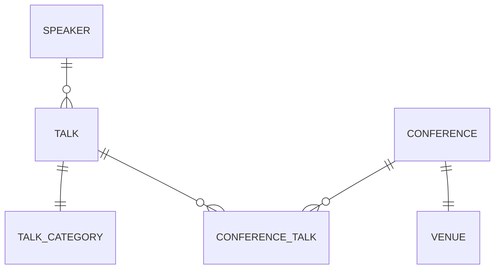

# MOCA CONF

IT IS JUST A DEMO PROJECT FOR THE SPEECH

IT IS STILL UNDER ACTIVE DEVELOPMENT

## What is it?

Welcome to the moca-conf application repository! This application is designed to help organize conferences, manage  
speakers, and schedule programs using Laravel and Filament.

## About the Talk

This repository is part of my upcoming speech at [MOCA 2024](https://moca.camp), titled **"Rapid Application Development with Laravel and Filament"**.

During the talk, I will demonstrate how to quickly build robust applications using Laravel and Filament,  
focusing on how these tools can streamline the development process.

## Application Features

- **Conference Management:** Easily create and manage conferences.
- **Speaker Management:** Add, edit, and organize speaker information.
- **Program Scheduling:** Plan and schedule conference programs and sessions.

and why not, a little of AI to help us to manage the conference.

## Application Stages

### 00: Installing Laravel

In this stage, we will install Laravel and set up the project.

```bash
laraven new moca-conf
```

I've choosen SQLite as the database for this project and Pest as the testing framework.

### 01: INIT TailwindCSS, Pest, Larapint, PHPStan and Larastan

- **TailwindCSS:** A utility-first CSS framework for rapidly building custom designs.
- **Laravel Pint:** Code style fixer for minimalists
- **Pest:** A delightful PHP Testing Framework with a focus on simplicity.
- **PHPStan:** A PHP Static Analysis Tool that focuses on finding errors in your code without actually running it.
- **Larastan:** A PHPStan wrapper for Laravel that focuses on finding errors in your Laravel code.

#### TailwindCSS

```bash
npm install -D tailwindcss postcss autoprefixer
npx tailwindcss init -p
```

or with Bun

```
bun install -D tailwindcss postcss autoprefixer
bun tailwindcss init -p
```

then follow the instructions in the [TailwindCSS documentation](https://tailwindcss.com/docs/guides/laravel).

#### Laravel Pint

```bash
composer require laravel/pint --dev
```

#### Pest

In the laravel installation wizard we've choosen Pest as the testing framework, so we don't need to install it. I'm
installing
some additional plugins and package to help us to write tests.

```bash
composer require pestphp/pest-plugin-livewire --dev
composer require pestphp/pest-plugin-faker --dev
```

#### PHPStan and Larastan

```bash
composer require --dev "larastan/larastan:^2.0"
```

configure `phpstan.neon` file

```neon
includes:
    - vendor/larastan/larastan/extension.neon

parameters:

    paths:
        - app/

    # Level 9 is the highest level
    level: 9

#    ignoreErrors:
#        - '#PHPDoc tag @var#'
#
#    excludePaths:
#        - ./*/*/FileToBeExcluded.php
#
#    checkMissingIterableValueType: false
```

and run first analysis

```bash
./vendor/bin/phpstan analyse
```

in first instance we should fix `User` model specifying the factory class.

### 02: Models

In this stage, we will create the following models:

- **Speaker:** A model to store speaker information.
- **Talk:** A model to store talk information.
- **TalkCategory:** A model to store talk TalkCategory information.
- **Conference:** A model to store conference information.
- **Venue:** A model to store venue information.

Pivot model:

- **ConferenceTalk:** A pivot model to store the relationship between conferences and talks.



For local development, we have created factories and seeders for each model.

```bash  
php artisan migrate:fresh --seed
```  

### 03: Filament Panel Builder

Filament Panel Builder is a package that allows you to create custom admin 
panels for your Laravel applications: Panels are the top-level container 
in Filament, allowing you to build feature-rich admin panels that include 
pages, resources, forms, tables, notifications, actions, infolists, and 
widgets

In this stage, we will install Filament and set up the project.

See the official docs for more information: 
[Filament Panel Builder](https://filamentphp.com/docs/3.x/panels/installation)

```bash
composer require filament/filament:"^3.2" -W
 
php artisan filament:install --panels

# choose "admin" as ID
````

This will create and register a new Laravel service provider called
`app/Providers/Filament/AdminPanelProvider.php`.

The Filament Panel Builder pre-installs the Form Builder, Table Builder,
Notifications, Actions, Infolists, and Widgets packages. No other
installation steps are required to use these packages within a panel.

You can create a Filament User with this command:

```bash
php artisan make:filament-user
```

If you run the database seeders, you don't need to create a new user.

Now you can access the Filament admin panel at `/admin`.

  
### 04: Filament - Resources  

In this stage, we will create the following resources:
- **SpeakerResource:** A resource to manage speaker information.  
- **TalkResource:** A resource to manage talk information.  
- **TalkCategoryResource:** A resource to manage talk TalkCategory information.  
- **ConferenceResource:** A resource to manage conference information.  
- **VenueResource:** A resource to manage venue information.  

Resources are static classes that are used to build CRUD interfaces for your Eloquent models. They describe how 
administrators should be able to interact with data from your app - using tables and forms.

Filament can automatically generate the form and the table of each resource. It allows you to speed up the development. 
The focus of this talk and this demo project is "Rapid Application Development with Laravel".

To create the resources, we will use the following command:
  
```bash  
php artisan make:filament-resource Venue --generate  
php artisan make:filament-resource Conference --generate  
php artisan make:filament-resource TalkCategory --generate  
php artisan make:filament-resource Talk --generate  
php artisan make:filament-resource Speaker --generate  
```

The `--generate` flag asks Filament to generate the form and the table for the resource. For each resource this will 
create serveral files in the `app/Filament/Resources` directory:

E.g.:
```
app
├── Filament\
│         └── Resources\
│             ├── ConferenceResource\
│             │         └── Pages\
│             │             ├── CreateConference.php
│             │             ├── EditConference.php
│             │             └── ListConferences.php
│             ├── ConferenceResource.php
```

The resource lives in `ConferenceResource.php`. The classes in the `Pages` directory are used to customize the pages in
the app that interact with the resource.  All these pages are full-page Livewire components and are fully customizable.

It's important to note that Filament resources adhere to Laravel's authorization policies, ensuring that user 
interactions are secure and within the boundaries set by your application's access controls.

For more information: [Filament Panel Builder - Resources - Get Started](https://filamentphp.com/docs/3.x/panels/resources/getting-started)

#### DemoCommand

I created a console command to simplify the demo of the application. In this stage the command has four options:
- run a fresh migration
- run a fresh migration with seeders
- seed the database
- create a demo user.

To run the command:

```bash
php artisan mc:demo
```

#### Unguarding all models

For brevity in this demo project, we will disable Laravel's mass assignment protection. Filament only saves valid data
to models so the models can be unguarded safely.

For more information: [Eloquent Mass Assignment](https://laravel.com/docs/11.x/eloquent#mass-assignment)
